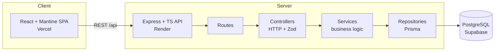

# Architecture

## Layering rationale
- Controllers do HTTP + validation only; services hold logic (and are unit-tested without HTTP);
  repositories isolate Prisma so services are testable with a mocked repo.
- Money as integer cents + ISO currency avoids float drift; conversion via a fixed-rate util.

## Key trade-offs
- Offset pagination (simple page numbers) over cursor — fine at 10k scale, better UX for HR.
- Supabase pooled connection for the app, direct connection for migrations (Prisma requirement).
- Fixed FX table over live rates — see requirements for reasoning.